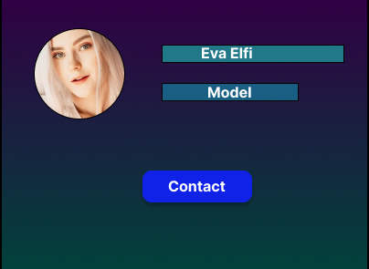
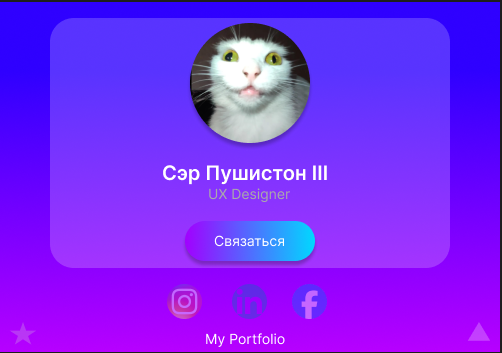
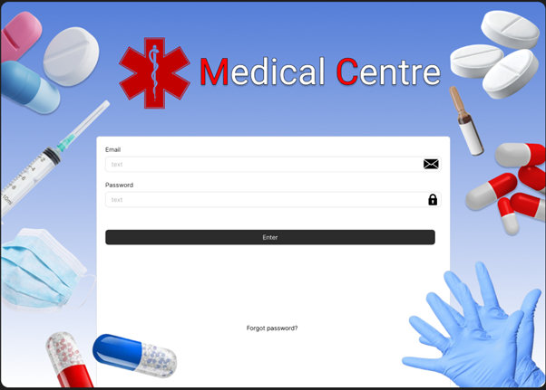

## Figma
# -Project1:
https://www.figma.com/design/R6TmL144Nn2MFsnrHiE9kR/%D0%A3%D0%BF%D1%80%D0%B0%D0%B6%D0%BD%D0%B5%D0%BD%D0%B8%D0%B5-%D0%9F%D1%80%D0%BE%D1%84%D0%B8%D0%BB%D1%8C?node-id=0-1&p=f&t=4AJYZ3PdgpVV3yPg-0

//Создание профиля
# -Project2:
https://www.figma.com/design/kPfwXgA4YvWbvUx1ZO4tNI/%D0%9F%D1%80%D0%BE%D1%84%D0%B8%D0%BB%D1%8C-Glass?t=4AJYZ3PdgpVV3yPg-0

//Профиль - Glass
# -Project3:
https://www.figma.com/design/dSrIEckhRDzCZuQGMiNAK1/%D0%A3%D0%BF%D1%80%D0%B0%D0%B6%D0%BD%D0%B5%D0%BD%D0%B8%D0%B5-%D0%B0%D0%BD%D0%B8%D0%BC%D0%B0%D1%86%D0%B8%D1%8F-%D0%BE%D0%B1%D1%8A%D0%B5%D0%BA%D1%82%D0%B0?t=4AJYZ3PdgpVV3yPg-0

//Анимация объекта
# -Project4:
https://www.figma.com/design/4QdB0o90wj65Lk8S5Fdwlx/%D0%9F%D1%80%D0%B5%D0%B7%D0%B5%D0%BD%D1%82%D0%B0%D1%86%D0%B8%D1%8F?t=4AJYZ3PdgpVV3yPg-0

//Презентация

# -Project5:
https://www.figma.com/design/HJPFTTV3Y4U6I053tXG8ZS/Lab-%E2%80%94-UI-Libraries?t=k9CRwNNeRgjMKuut-0

//UI Библиотеки
